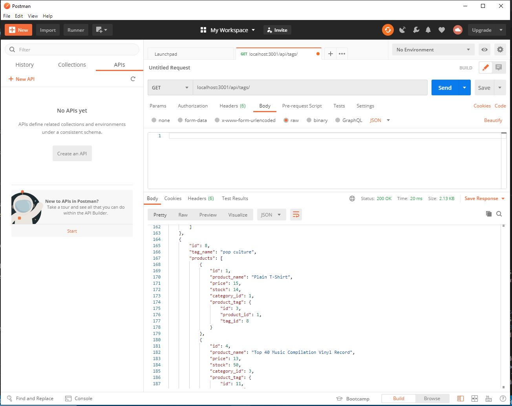

# E-Commerce Shopper

# Tutorial
Pt-1: https://drive.google.com/file/d/1aDg2nHnMgC2yZEvxHHO47RLWCBD_xnET/view
Pt-2: https://drive.google.com/file/d/1NU48fXdrsu0lXY-bI4eynTH0no3H648o/view

## Purpose
To provide the user with a back end for an e-commerce website that uses the latest technologies in order to maintain a competitive edge.

## Features
When the user seeds the database with their category, product, and tag data, they are provided with the ability to find, create, update, and delete data via sequelize API routes. GET routes can return all categories, products, and tags; a single category, a single product, and a single tag. Relationships between categories/products/tags are created vis associations.

## Built With
* JavaScript
* Node JS 
* Express
* MySQL
* Sequelize
* Dotenv

## API testing
Postman

## Usage
To run program: node server

## Project Status
The e-commerce application is compliant with defined acceptance criteria

## Contribution
Created by Jennifer Mulder

